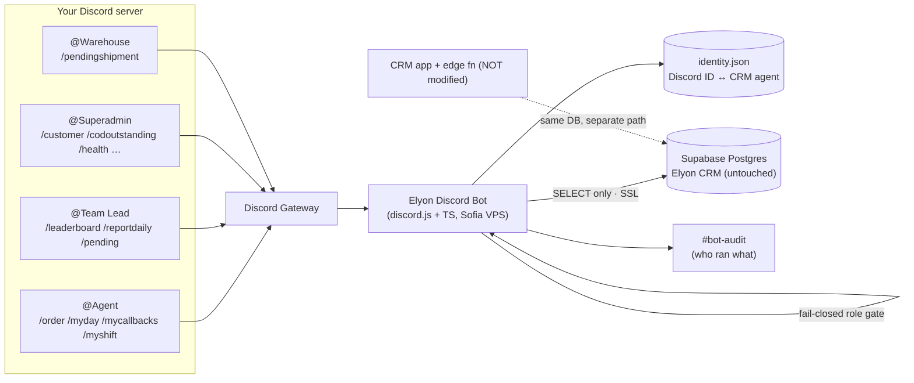

# Elyon CRM — Discord Bot (as built)

A standalone, **read-only** Discord bot that exposes Elyon CRM data through slash commands.
No LLM, no paid APIs, free to run. It never writes to the CRM and never touches the CRM code,
Asterisk/PBX, or recordings.

- **Stack:** discord.js + TypeScript (matches the CRM language).
- **Data:** a dedicated **SELECT-only** Postgres role on the Elyon Supabase database.
- **Agent scope:** agents can only see **their own** orders (resolved via a Discord↔CRM-agent map).
- **Hosting:** the Sofia VPS, under systemd, capped at 256 MB RAM / 50% CPU.

## Architecture

## How the anchors map to real data (verified against the schema)

- **Order number:** `orders.display_id` = `'ORD-' || LPAD(seq,5,'0')`. `/order 13346` → `ORD-13346`
  (also accepts `ORD-13346`, `#13346`, or a UUID).
- **Status** is one enum: `pending | take | call_again | confirmed | shipped | delivered | returned |
  paid | trashed | cancelled`. **COD only** — `paid` = cash collected; `shipped` = COD outstanding.
- **No `shipped_at`/`paid_at`/`tracking_number`** columns — ship/deliver/paid times come from
  `order_history`; there are no courier tracking numbers (the bot shows courier + office instead).
- **Owner = first-confirmer:** `confirmed_by_agent_id ?? assigned_agent_id` (mirrors `salesOwnerId`).
- **Daily KPIs** mirror the CRM `agent-performance` buckets exactly (filtered by `created_at`, in
  Europe/Sofia): leads / confirmed / shipped / paid / returned / cancelled, conversion %,
  collection % (paid÷shipped), return %, paid revenue, outstanding COD, returned value, packages,
  and commission (€1/€2/€3 per package by unit price, paid orders only).
- **Work time** comes from `shifts` + `shift_assignments` + `shift_login_logs` (logged-in time) +
  `shift_breaks`, with talk time from `call_logs.talk_seconds`.

## Command catalog (built)

| Command | Tiers | What it does |
|---|---|---|
| `/order <number>` | Agent*/Lead/Admin | Full order status. *Agents: own orders only. Leads: PII masked. |
| `/myday [date]` | Agent+ | Your own daily KPI breakdown + commission |
| `/mypending` | Agent+ | Your open orders (pending/taken/call-again) |
| `/mycallbacks` | Agent+ | Your call-again orders due now |
| `/myshift [date]` | Agent+ | Your work time: scheduled, logged-in, talk, breaks |
| `/mystats <from> <to>` | Agent+ | Your KPIs over a range |
| `/mycommission [from] [to]` | Agent+ | Your commission earned |
| `/whoami` | Anyone | Your access tier + CRM link |
| `/reportdaily <agent> [date]` | Lead/Admin | Daily report for any agent (commission shown to admin) |
| `/reportrange <from> <to> [agent]` | Lead/Admin | Range report, one agent or whole team |
| `/leaderboard [metric] [from] [to]` | Lead/Admin | Rank agents (revenue/paid/confirmed/commission) |
| `/pending [agent]` | Lead/Admin | Team-wide / per-agent open orders |
| `/callbacksdue [agent]` | Lead/Admin | Callbacks due across the team |
| `/codoutstanding [agent]` | Lead/Admin | Shipped-but-unpaid COD (cash in the field) + total |
| `/returns <from> <to> [agent]` | Lead/Admin | Returns grouped by reason |
| `/cancellations <from> <to> [agent]` | Lead/Admin | Cancellations grouped by reason |
| `/worktime <agent\|all> [date]` | Lead/Admin | Work time for one agent or the whole team |
| `/calls <agent> [date]` | Lead/Admin | Call outcomes + talk time for an agent |
| `/topproducts <from> <to>` | Lead/Admin | Best-selling products (paid) |
| `/customer <phone>` | Admin | Customer order history (PII, ephemeral) |
| `/pendingshipment` | Warehouse/Admin | Confirmed orders awaiting shipment |
| `/health` | Admin | Today's pulse (orders, paid, revenue, outstanding, pending pool) |
| `/linkagent <user> <email>` | Admin | Link a Discord user to a CRM agent |
| `/unlinkagent <user>` | Admin | Remove a link |

"Agent+" = Agent, Team Lead, or Admin (it always reports on the **caller's own** linked agent).

## Role model & GDPR

- **Fail-closed gate:** every command declares `allowedTiers`; the router resolves the caller's tier
  from Discord role IDs and refuses to run the handler unless it matches. Default = **deny**.
  Superadmin can run everything. Agents are additionally scoped to their own orders in SQL.
- **PII:** personal/PII commands reply **ephemeral** (only the caller sees them). `/customer` is
  admin-only. Team leads see **masked** customer name/phone/address. Every invocation is logged to
  `#bot-audit`.

## Files

Bot code lives in `discord-bot/` (own `package.json`, isolated). See `discord-bot/README.md` for the
layout. Setup/checklist: [CHECKLIST.md](CHECKLIST.md). Server structure:
[DISCORD_SERVER_SETUP.md](DISCORD_SERVER_SETUP.md). Per-command reference: [COMMANDS.md](COMMANDS.md).

## Notes / limitations

- No tracking numbers exist in the CRM; `/order` shows courier + office only.
- Ship/deliver/paid timestamps depend on `order_history`; legacy orders with sparse history show "—".
- Daily reports use `created_at` (same as the CRM). Switching to `confirmed_at` is a one-line change.
